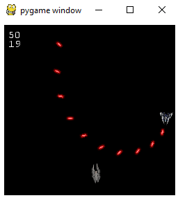
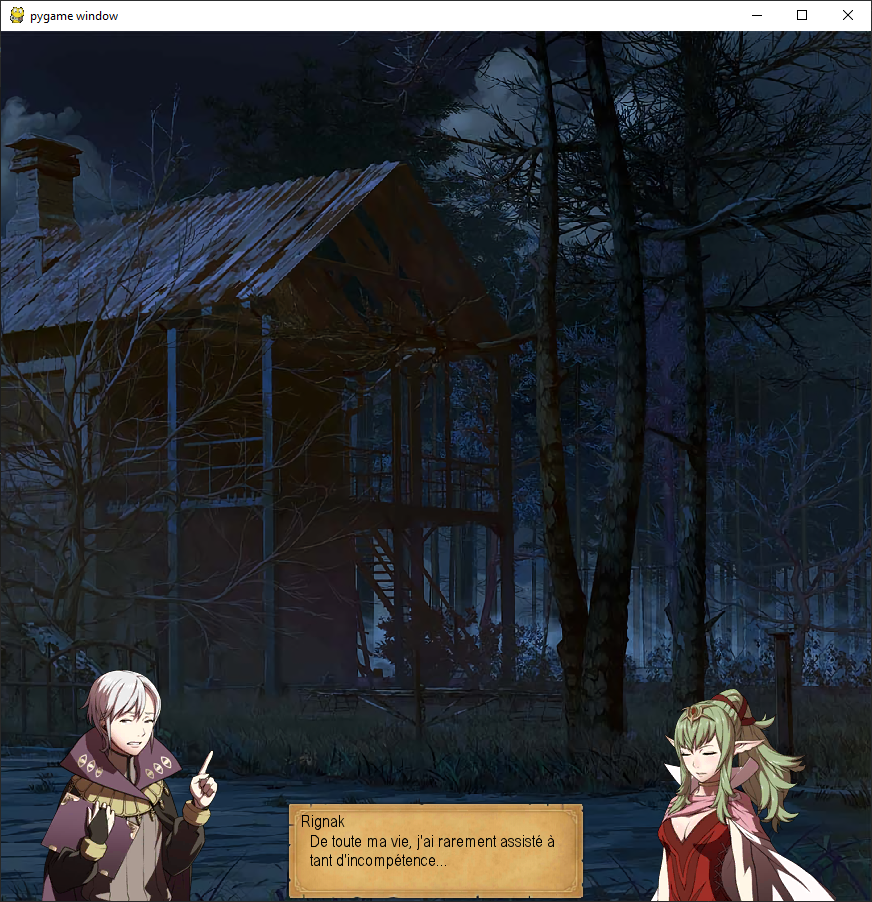
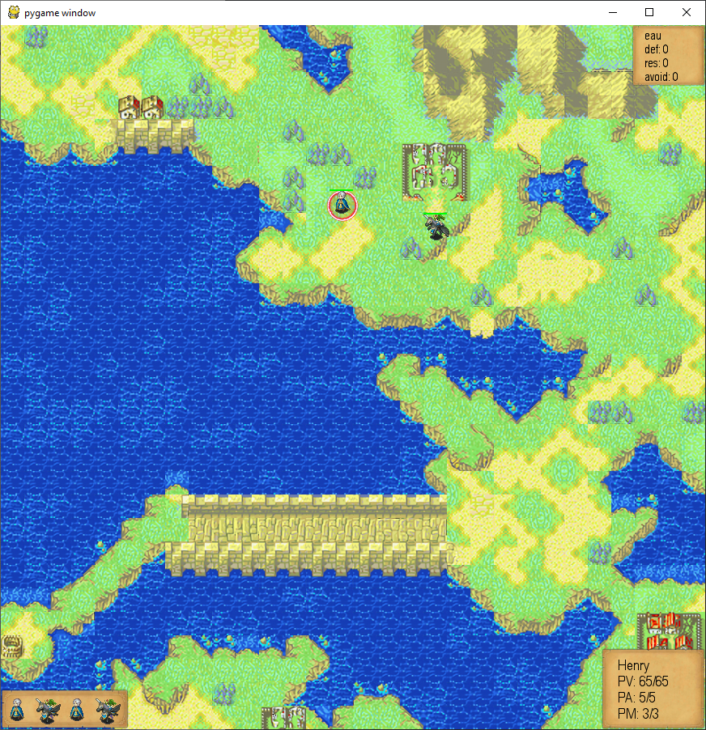
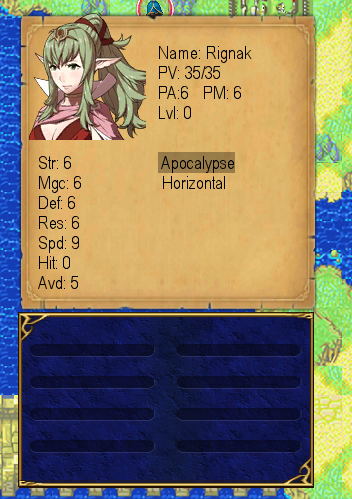
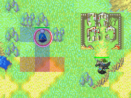

# Games

## Asteroid

A shmup coded for reinforcement learning. The player pilot a space ship moving in 2d with 5 commands:
 - up arrow to increase the radial speed ;
 - down arrow to decrease the radial speed ;
 - left arrow to increase the rotational speed to the left ;
 - right arrow to increase the rotational speed to the right ;
 - spacebar to fire.
 
The player die if :
 - the ship collides with the borders of the screen ;
 - the ship collides with one of the other ship.
 
The bullet fired by the ship can destroy ships, but the dammages are impactedby the position of the impact (damages increase when fired on the rear).

On this screenshot, we can see the player ship a few frames before dying. It is firing when spining.

In the top-left corner, the first number is the score, the second the framerate.

## TRPG

This one is my first attempt with Pygames. It is one of the few scripts to have survive a massive refactoring done in September 2019.
The reason is that it currently works, but as a large spaghetti plate, it is very dangerous to try to change anything.

It opens on a level selection, then procede to vn-like prologue (btw, a minimal version of a visual novel is also present in the repo ~~though using rempy would be more smart~~).

After the prologue is the game, a mix between Fire Emblem and Dofus. 

On the bottom-left corner is the initiative panel, showing wich units will be the next to act. 
On the bottom-right is the status of the selected unit, with its HP, AP, and MP. Just above this box can appear a help box with description of the selected key in the menus.

The next image show a status screen with description of the characeters, its statistics, skills and items.

When we select a skill, the potiental targets appear in blue, and the AoE in red.

Now a gif of the first instants of the prologue (heavy gifs are subject to bugs).

